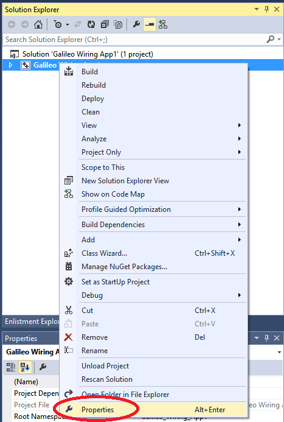
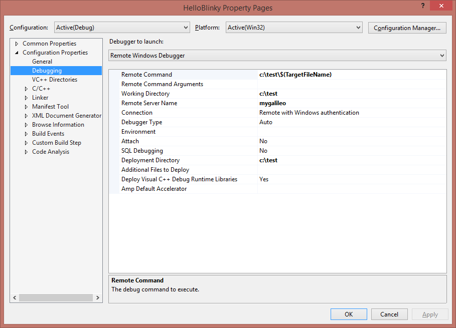
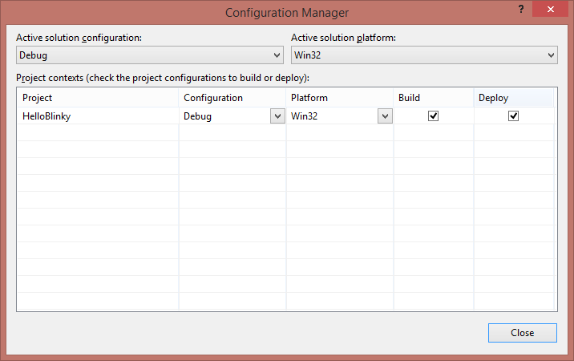
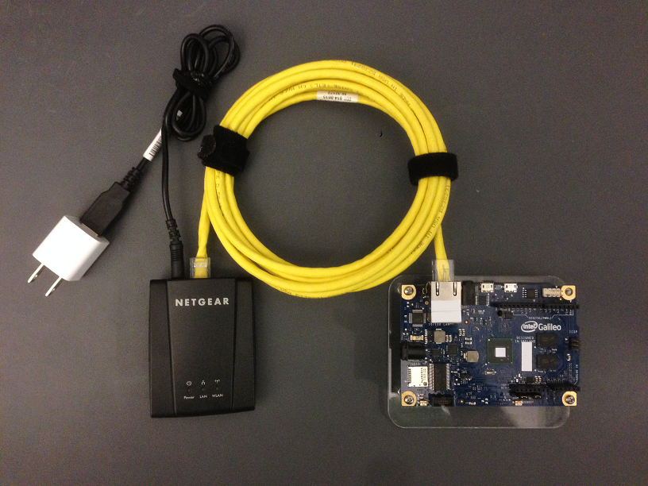
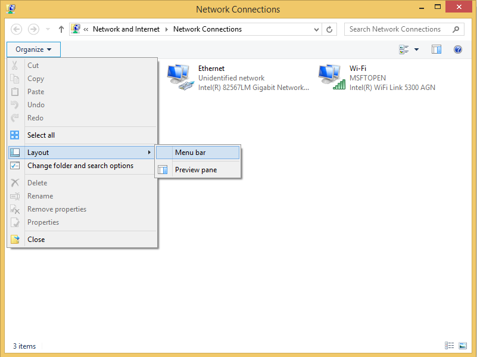

  

    <h1>Advanced Usage</h1>
  

  <h3>Communication with Galileo</h3>
  

    

      

        <h4 class="panel-title">
          <a data-toggle="collapse" data-parent="#accordion0" href="#collapseNetworkShare">
            Open a network share to your Galileo
          </a>
        </h4>
      

      

        

          Open up a file explorer window and type the following into the address bar: 
          <kbd>\\YourGalileoName\c$</kbd>
        

      

    

    

      

        <h4 class="panel-title">
          <a data-toggle="collapse" data-parent="#accordion0" href="#collapseRemoteDebugging">
            Configure remote debugging
          </a>
        </h4>
      

      

        

          

            With your project open in Visual Studio:
            <ul>
              <li>
                Right click on your project (not solution) in the Solution Explorer and select <kbd>Properties</kbd> 
                
              </li>
              <li>Expand <kbd>Configuration Properties</kbd></li>
              <li>Select the <kbd>Debugging</kbd> tree item</li>
              <li>Change the <kbd>Debugger to launch</kbd> to <kbd>Remote Windows Debugger</kbd></li>
              <li>
                Configure the debug page like the following picture, paying close attention to the debug settings: 
                
              </li>
            </ul>
          

          

            
Visual Studio Debug Settings

            

              Please change the following settings to configure remote debugging: 
              Remote Command: <kbd>c:\test\$(TargetFileName)</kbd> 
              Working Directory: <kbd>c:\test</kbd> 
              Remote Server Name: <kbd>mygalileo</kbd> 
              Deployment Directory: <kbd>c:\test</kbd> 
               
              <b>NOTE:</b> If you want to change the directory that your project is deployed to and run out of you will need to change all of the places it says c:\test\ to your desired path. 
              <b>NOTE:</b> If you change your Galileo's name, you will need to change the Remote Server Name to match.
            

          

            
          <h4>Configure remote deploying</h4>
          Before you close the Property Pages, select the <kbd>Configuration Manager...</kbd> button from the upper right corner. 
          Make sure "Deploy" is checked for your project 
           
        

      

    

    

      

        <h4 class="panel-title">
          <a data-toggle="collapse" data-parent="#accordion0" href="#collapseUART">
            Allow UART port to be used by HardwareSerial
          </a>
        </h4>
      

      

        

            This will change it from Kernel Debugger use.
            <ol>
                <li> Shut down Galileo and remove power </li>
                <li> Remove micro-SD card and plug it in to a PC--it mounted as drive “K:” </li>
                <li> In Admin cmd window on PC: </li>
                    <ul>
                        <li> <kbd>bcdedit /store k:\efi\microsoft\boot\bcd /enum</kbd> </li>
                        <li> Verify you got bcd contents </li>
                        <li> <kbd>bcdedit /store k:\efi\microsoft\boot\bcd /set {default} debug No</kbd> </li>
                        <li> <kbd>bcdedit /store k:\efi\microsoft\boot\bcd /set {default} testsigning OFF</kbd> </li>
                        <li> <kbd>bcdedit /store k:\efi\microsoft\boot\bcd /enum</kbd> </li>
                        <li> Verify debug and testsigning are now “No” </li>
                    </ul>
                <li> Safe dismount of micro-SD from PC (eject from Windows Explorer) </li>
                <li> Put micro-SD in Galileo and powered up </li>
            </ol>
        

      

    

  

  

  
  <h3>Customized Experience</h3>
  

    

      

        <h4 class="panel-title">
          <a data-toggle="collapse" data-parent="#accordion1" href="#collapseGalileoAutorun">
            Making your Galileo run an exe on boot
          </a>
        </h4>
      

      

        

          <ol>
            <li>From a file explorer window, navigate to <kbd>\\mygalileo\c$\Windows\System32\Boot</kbd></li>
            <li>If prompted enter the username as \Administrator and the password as admin</li>
            <li>Right click on <kbd>autorun.cmd</kbd> and select Edit</li>
            <li>At the end of the file add: <kbd>start YourAppLocation\YourAppName.exe</kbd></li>
          </ol>
        

      

    

    

      

        <h4 class="panel-title">
          <a data-toggle="collapse" data-parent="#accordion1" href="#collapseGalileoName">
            Changing your Galileo's Name
          </a>
        </h4>
      

      

        

          

            Through telnet, run SetComputerName using the following line 
            <kbd>SetComputerName YourNewName</kbd> 
          

          

            
Note:

            

              If you change your Galileo's name, it will break remote deployment and you will need to change the remote debugging/deployment settings on all projects to match.
            

          

        

      

    

  

      

        <h4 class="panel-title">
          <a data-toggle="collapse" data-parent="#accordion1" href="#collapseTaskList">
            View/Kill Active Tasks
          </a>
        </h4>
      

      

        

          

            Through telnet, run 'tlist' to view currently running tasks 
            <kbd>C:\>tlist</kbd> 
            <samp>  0 System Process 
                    4 System 176 smss.exe 
                  256 csrss.exe 
                  284 wininit.exe 
                  292 csrss.exe 
                  308 winlogon.exe 
                  328 services.exe 
                  340 lsass.exe 
                  420 svchost.exe 
                  752 cmd.exe 
                  764 msvsmon.exe 
                  772 Galileo_eboot.exe 
                  780 httpsrv.exe 
                  788 ftpd.exe 
                  796 telnetd.exe 
                  804 mwstartnet.exe 
                  860 msvsmon.exe 
                 1284 TemperatureSensor.exe 
                 1472 cmd.exe 
                  112 tlist.exe
            </samp> 
          

          

            Through telnet, run 'kill PID' or 'kill Name' to kill a currently running task 
            <kbd>C:\>kill 1284</kbd> 
            <samp>process TemperatureSensor.exe (1284) - '' killed</samp> 
            <kbd>C:\>kill TemperatureSensor.exe</kbd> 
            <samp>process TemperatureSensor.exe (1284) - '' killed</samp> 
          

          

            
Note:

            

              Using 'kill Name' on will close all tasks with that name.
            

          

        

      

    

	
    

      

        <h4 class="panel-title"> <a data-toggle="collapse" data-parent="#accordion1" href="#collapseAddDriver"> Add a driver to Windows</a> </h4>
      

      

        

          
 <strong>1.</strong> Copy your windows image (.wim file) to "C:\Temporary\images"  
              <strong>2.</strong> Copy the drivers you wish to add to "C:\Temporary\drivers"  
              <strong>3.</strong> Create an empty folder named "offline" to "C:\Temporary\" so the final path would be "C:\Temporary\offline"  
              <strong>4.</strong> Run a Command Line (cmd.exe) as Administrator.  
              <strong>4a.</strong><i> Get Informations about the image file.</i> 
            <kbd>Dism /Get-WimInfo /WimFile:C:\Temporary\images\9600.16384.x86fre.winblue_rtm_iotbuild.140731-1000_galileo_v1.wim</kbd> 
            <samp>Deployment Image Servicing and Management tool 
                  Version: 6.3.9600.17031 
                  Details for image : C:\Temporary\images\9600.16384.x86fre.winblue_rtm_iotbuild.140731-1000_galileo_v1.wim 
                  Index : 1 
                  Name : MODERNCORE_INSTALL 
                  Description : <undefined> 
                  Size : 800,100,664 bytes 
                  Index : 2 
                  Name : MODERNCORE_BOOT 
                  Description : <undefined> 
                  Size : 763,402,132 bytes 
                  The operation completed successfully. 
            </samp> 
              <strong>4b.</strong><i> Mount the offline Windows image file.</i> 
            <kbd>Dism /Mount-Wim /WimFile:C:\Temporary\images\9600.16384.x86fre.winblue_rtm_iotbuild.140731-1000_galileo_v1.wim /Name:"MODERNCORE_INSTALL" /MountDir:C:\Temporary\offline</kbd> 
            <samp>Deployment Image Servicing and Management tool 
                  Version: 6.3.9600.17031 
                  Mounting image 
                  [==========================100.0%==========================] 
                  The operation completed successfully. 
             </samp> 
              <strong>4c.</strong><i> Add the specific driver to the offline image.</i> 
            <kbd>Dism /Image:C:\Temporary\offline /Add-Driver /Driver:C:\Temporary\drivers\'your_driver_name.inf'</kbd> 
            <samp>Deployment Image Servicing and Management tool 
                  Version: 6.3.9600.17031 
                  Image Version: 6.3.9600.16384 
                  Found 1 driver package(s) to install. 
                  Installing 1 of 1 - C:\Temporary\drivers\'your_driver_name.inf': The driver package was successfully installed. 
                  The operation completed successfully. 
             </samp>
          

          

            
Note:

            
 For adding multiple drivers use /Recurse option. 
            <kbd>Dism /Image:C:\Temporary\offline /Add-Driver /Driver:C:\Temporary\drivers\ /Recurse</kbd> 
            

          
 
          

              <strong>4d.</strong><i> Commit the changes to the image.</i> 
            <kbd>Dism /Unmount-Wim /MountDir:C:\Temporary\offline /Commit</kbd> 
            <samp>Image Index : 1 
                  Saving image 
                  [==========================100.0%==========================] 
                  Unmounting image 
                  [==========================100.0%==========================] 
                  The operation completed successfully. 
             </samp> 
              <strong>6.</strong> Now you can apply Microsoft Windows to an microSD card as described here: <a href="https://ms-iot.github.io/content/IBoughtAGalileo.htm" target="_blank">Bought or updating your Intel Galileo?</a> 
              <strong>7.</strong> To see if your driver works through telnet use 'devcon' command. For devcon command help look <a href="http://msdn.microsoft.com/en-us/library/windows/hardware/ff544746(v=vs.85).aspx" target="_blank">here.</a> 
          

        

      

    

	
  

  

  <h3>Network Connectivity</h3>
  

    

      

        <h4 class="panel-title">
          <a data-toggle="collapse" data-parent="#accordion2" href="#collapseWifiToEthernetAdapter">
            Setup a Wi-Fi to Ethernet adapter
          </a>
        </h4>
      

      

        

          
An often overlooked option for wirelessly connecting your Galileo to the internet is to use a <a href="http://www.newegg.com/Product/ProductList.aspx?Submit=ENE&DEPA=0&Order=BESTMATCH&Description=wireless+to+ethernet+adapter&N=-1&isNodeId=1" target="_blank">Wi-Fi to Ethernet adapter</a>.

           
          <i>Netgear WNCE2001 pictured</i>
        

      

    

    

      

        <h4 class="panel-title">
          <a data-toggle="collapse" data-parent="#accordion2" href="#collapseBridgeNetworkConnection">
            Bridge your PC's network connection to the Galileo
          </a>
        </h4>
      

      

        

          
You can provide internet connectivity (wireless or other) by sharing, or "bridging", your PC's network connection.

          
When you connect your Galileo to your PC directly (as outlined <a href="./SetupGalileo.htm" target="_blank">here</a>), then you can share the network connection the PC is using to connect to the internet with the Galileo by following these steps:

          <ul>
            <li>Open the "<b>Network and Sharing Center</b>" from the Start Screen.</li>
              
            <li>Select "<b>Change adapter settings</b>" from the left hand column.</li>
              
            <li>In the network connection settings select "<b>Layout->Menu bar</b>" from the "<b>Organize</b>" drop down menu.</li>
              
            <li>Select your "Ethernet" connection (to the Galileo) and your other connection (to the internet) [<i>"Wi-Fi" pictured</i>].</li>
              
            <li>Wait for connection to be created...</li>
              
            <li>Once the bridge has been created and new connection will appear, labelled "Network Bridge".</li>
              
          </ul>
          
Now that your network bridge has been setup, your Galileo should be able to access the internet via your PC's internet connection.

          
Use <kbd>ping bing.com</kbd> from a telnet session to your Galileo to confirm.

        

      

    

  

  

  <a class="btn btn-default" href="index.htm" role="button">Return to homepage</a>

