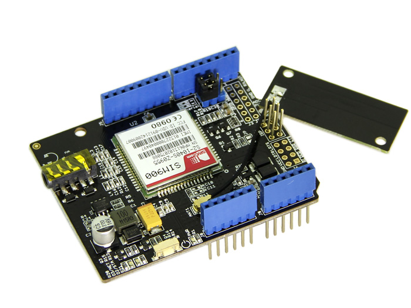
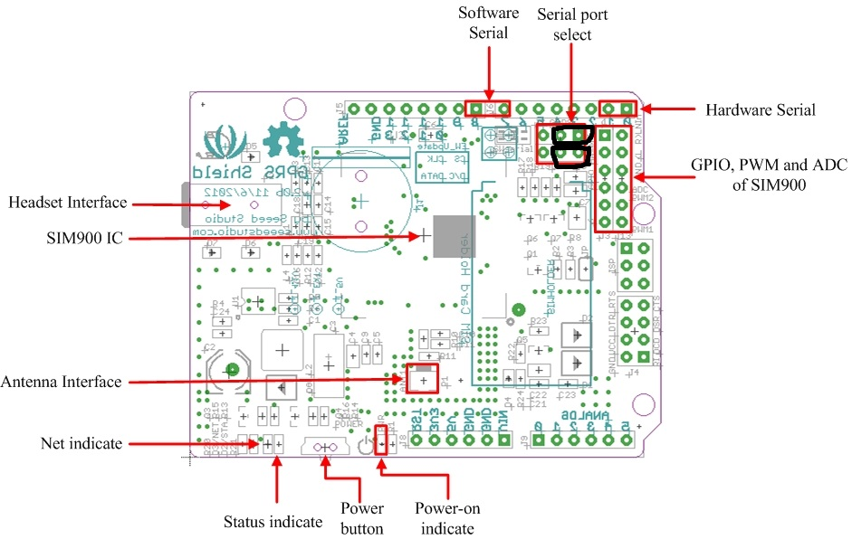

# SeedStudio GSM shield
Learn how to use the SeedStudio GSM shield

{:width="400"}

# Required Components
* [Seed Studio GSM shield](http://www.seeedstudio.com/depot/GPRS-Shield-V20-p-1379.html){:target="_blank"}

# Shield setup
* Move the two switches to the rigth (Serial port select as indicates in the image) to select the hardware serial 
{:width="400"}

# Create a new project

1. Create a new project from the template.
2. Replace the existing code in main.cpp with the following code:
3. Add to the project the files GSM.cpp, HWSerial.cpp, SIM900.cpp and sms.cpp
   found in [GSM Library](https://github.com/dacolgit/GSM-GPRS-GPS-Shield)

# Code

### Main.cpp

	// Main.cpp : Defines the entry point for the console application.
	//
	// Sample application for sending SMS using GSM library - dacol 07/2014
	//

	#include "stdafx.h"
	#include "arduino.h"
	#include "SIM900.h"
	#include "sms.h"

	SMSGSM sms;

	// Helper function for logging to debug output and the console
	void CustomLogging(char* str)
	{
		OutputDebugStringA(str); // for VS Output
		printf(str); // for commandline output
	}

	int _tmain(int argc, _TCHAR* argv[])
	{
		return RunArduinoSketch();
	}

	void setup()
	{
		CustomLogging("Init GSM module.\n");
		gsm.begin(19200);
	}

	void loop()
	{
		// Add your phone number
		char phoneNumber[] = { "+49151123456" };
		char smstext[] = { "Hi, This message was sent to you By Galileo" };
		int smsCounter = 0;
		int maxSMSSent = 1;

		CustomLogging("Sending sms.\n");

		if (smsCounter < maxSMSSent)
		{
			sms.SendSMS(phoneNumber, smstext);
			smsCounter++;
		}

		CustomLogging("sms sent.\n");
	}



---

[&laquo; Return to Samples](SampleApps.htm){:role="button"}{:class="btn btn-default"}
