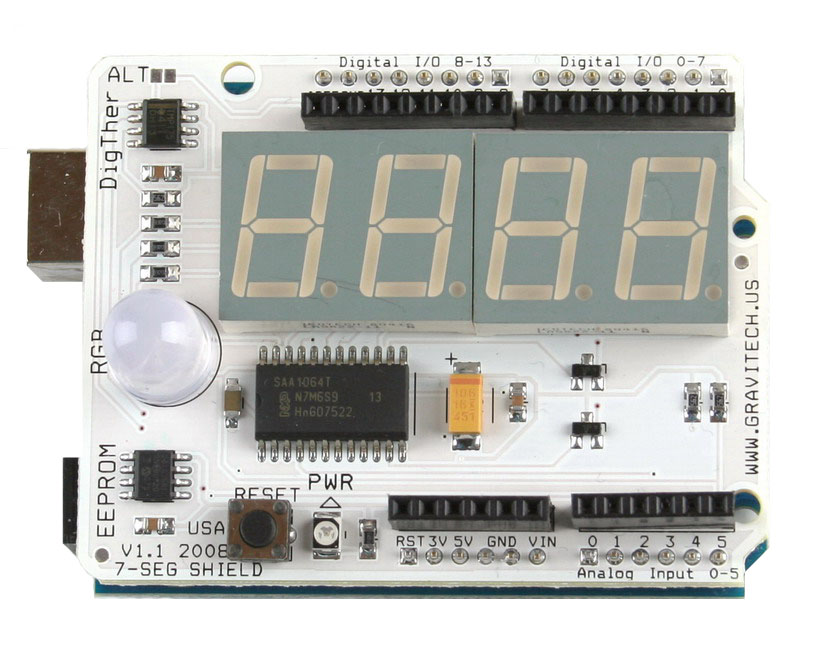

# Gravitech 7-Segment Shield
Learn how to use a Gravitech 7-Segment Shield.

{:width="400"}

# Required Components
* [Gravitech 7-Segment Shield](http://www.gravitech.us/7segmentshield.html){:target="_blank"}

# Create a new project

1. Create a new project from the template.
1. Replace the existing code in main.cpp with the following code:

# Code

### Main.cpp

	// Main.cpp : Defines the entry point for the console application.
	//
	
	#include "stdafx.h"
	#include "arduino.h"
	
	
	#define BAUD (9600)    // Serial baud define 
	#define _7SEG (0x38)   // I2C address for 7-Segment 
	#define THERM (0x49)   // I2C address for digital thermometer 
	#define EEP (0x50)     // I2C address for EEPROM 
	#define RED (3)        // Red color pin of RGB LED 
	#define GREEN (5)      // Green color pin of RGB LED 
	#define BLUE (6)       // Blue color pin of RGB LED 
	
	#define COLD (23)      // Cold temperature, drive blue LED (23c) 
	#define HOT (26)       // Hot temperature, drive red LED (27c) 
	
	const byte NumberLookup[16] = { 0x3F, 0x06, 0x5B, 0x4F, 0x66,
									0x6D, 0x7D, 0x07, 0x7F, 0x6F,
									0x77, 0x7C, 0x39, 0x5E, 0x79, 0x71 };
	
	// Function prototypes 
	void Cal_temp(int&, byte&, byte&, bool&);
	void Dis_7SEG(int, byte, byte, bool);
	void Send7SEG(byte, byte);
	void SerialMonitorPrint(byte, int, bool);
	void UpdateRGB(byte);
	
	
	int _tmain(int argc, _TCHAR* argv[])
	{
		return RunArduinoSketch();
	}
	
	// the setup routine runs once when you press reset:
	void setup() {
		Wire.begin();        /* Join I2C bus */
		pinMode(RED, OUTPUT);
		pinMode(GREEN, OUTPUT);
		pinMode(BLUE, OUTPUT);
		delay(500);          /* Allow system to stabilize */
	}
	
	// the loop routine runs over and over again forever:
	void loop() {
		int Decimal;
		byte Temperature_H, Temperature_L, counter, counter2;
		bool IsPositive;
	
		/* Configure 7-Segment to 12mA segment output current, Dynamic mode,
		and Digits 1, 2, 3 AND 4 are NOT blanked */
	
		Wire.beginTransmission(_7SEG);
		Wire.write(0);
		Wire.write(B01000111);
		Wire.endTransmission();
	
		/* Setup configuration register 12-bit */
	
		Wire.beginTransmission(THERM);
		Wire.write(1);
		Wire.write(B01100000);
		Wire.endTransmission();
	
		// Setup Digital THERMometer pointer register to 0 
	
		Wire.beginTransmission(THERM);
		Wire.write(0);
		Wire.endTransmission();
	
		// Test 7-Segment 
		for (counter = 0; counter<8; counter++)
		{
			Wire.beginTransmission(_7SEG);
			Wire.write(1);
			for (counter2 = 0; counter2<4; counter2++)
			{
				Wire.write(1 << counter);
			}
			Wire.endTransmission();
			delay(250);
		}
	
		while (1)
		{
			Wire.requestFrom(THERM, 2);
			Temperature_H = Wire.read();
			Temperature_L = Wire.read();
	
			// Calculate temperature 
			Cal_temp(Decimal, Temperature_H, Temperature_L, IsPositive);
	
			// Display temperature on the serial monitor.
			Comment out this line if you don't use serial monitor.
			SerialMonitorPrint(Temperature_H, Decimal, IsPositive);
	
			// Update RGB LED.
			UpdateRGB(Temperature_H);
	
			// Display temperature on the 7-Segment 
			Dis_7SEG(Decimal, Temperature_H, Temperature_L, IsPositive);
	
			// Take temperature read every 1 second 
			delay(1000);        
		}
	}
	
	/***************************************************************************
	Function Name: Cal_temp
	
	Purpose:
	Calculate temperature from raw data.
	****************************************************************************/
	void Cal_temp(int& Decimal, byte& High, byte& Low, bool& sign)
	{
		if ((High&B10000000) == 0x80)    // Check for negative temperature.
			sign = 0;
		else
			sign = 1;
	
		High = High & B01111111;      // Remove sign bit 
		Low = Low & B11110000;        // Remove last 4 bits 
		Low = Low >> 4;
		Decimal = Low;
		Decimal = Decimal * 625;      // Each bit = 0.0625 degree C 
	
		if (sign == 0)                // if temperature is negative 
		{
			High = High ^ B01111111;    // Complement all of the bits, except the MSB 
			Decimal = Decimal ^ 0xFF;   // Complement all of the bits 
		}
	}
	
	/***************************************************************************
	Function Name: Dis_7SEG
	
	Purpose:
	Display number on the 7-segment display.
	****************************************************************************/
	void Dis_7SEG(int Decimal, byte High, byte Low, bool sign)
	{
		byte Digit = 4;                 // Number of 7-Segment digit 
		byte Number;                    // Temporary variable hold the number to display 
	
		if (sign == 0)                  // When the temperature is negative 
		{
			Send7SEG(Digit, 0x40);         // Display "-" sign 
			Digit--;                      // Decrement number of digit 
		}
	
		if (High > 99)                  // When the temperature is three digits long 
		{
			Number = High / 100;          // Get the hundredth digit 
			Send7SEG(Digit, NumberLookup[Number]);     // Display on the 7-Segment 
			High = High % 100;            // Remove the hundredth digit from the TempHi 
			Digit--;                      // Subtract 1 digit 
		}
	
		if (High > 9)
		{
			Number = High / 10;           // Get the tenth digit 
			Send7SEG(Digit, NumberLookup[Number]);     // Display on the 7-Segment 
			High = High % 10;            // Remove the tenth digit from the TempHi 
			Digit--;                      // Subtract 1 digit 
		}
	
		Number = High;                  // Display the last digit 
		Number = NumberLookup[Number];
		if (Digit > 1)                  // Display "." if it is not the last digit on 7-SEG 
		{
			Number = Number | B10000000;
		}
		Send7SEG(Digit, Number);
		Digit--;                        // Subtract 1 digit */
	
		if (Digit > 0)                  // Display decimal point if there is more space on 7-SEG 
		{
			Number = Decimal / 1000;
			Send7SEG(Digit, NumberLookup[Number]);
			Digit--;
		}
	
		if (Digit > 0)                 // Display "c" if there is more space on 7-SEG 
		{
			Send7SEG(Digit, 0x58);
			Digit--;
		}
	
		if (Digit > 0)                 // Clear the rest of the digit 
		{
			Send7SEG(Digit, 0x00);
		}
	}
	
	/***************************************************************************
	Function Name: Send7SEG
	
	Purpose:
	Send I2C commands to drive 7-segment display.
	****************************************************************************/
	
	void Send7SEG(byte Digit, byte Number)
	{
		Wire.beginTransmission(_7SEG);
		Wire.write(Digit);
		Wire.write(Number);
		Wire.endTransmission();
	}
	
	/***************************************************************************
	Function Name: UpdateRGB
	
	Purpose:
	Update RGB LED according to define HOT and COLD temperature.
	****************************************************************************/
	
	void UpdateRGB(byte Temperature_H)
	{
		digitalWrite(RED, LOW);
		digitalWrite(GREEN, LOW);
		digitalWrite(BLUE, LOW);        // Turn off all LEDs. 
	
		if (Temperature_H <= COLD)
		{
			digitalWrite(BLUE, HIGH);
		}
		else if (Temperature_H >= HOT)
		{
			digitalWrite(RED, HIGH);
		}
		else
		{
			digitalWrite(GREEN, HIGH);
		}
	}
	
	/***************************************************************************
	Function Name: SerialMonitorPrint
	
	Purpose:
	Print current read temperature to the serial monitor.
	****************************************************************************/
	void SerialMonitorPrint(byte Temperature_H, int Decimal, bool IsPositive)
	{
		printf("The temperature is ");
		if (!IsPositive)
		{
			printf("-");
		}
		printf("%d.%d degree C\n\n", Temperature_H, Decimal);
	}



---

[&laquo; Return to Samples](SampleApps.htm){:role="button"}{:class="btn btn-default"}
