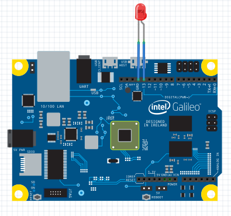
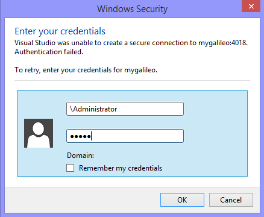
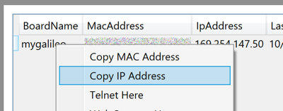

#Hello Blinky
Learn to Create, Deploy and Debug a Windows Developer Program for IoT project.

##Create a new Project
Open Visual Studio. Select File -> New Project and Select Templates -> Visual C++ -> Windows for IoT -> Galileo Wiring app

##Code

#include "stdafx.h"
#include "arduino.h"

int _tmain(int argc, _TCHAR* argv[])
{
  return RunArduinoSketch();
}

int led = 13;  // This is the pin the LED is attached to.

void setup()
{
  pinMode(led, OUTPUT); // Configure the pin for OUTPUT so you can turn on the LED.
}

// the loop routine runs over and over again forever:
void loop()
{
  digitalWrite(led, LOW);    // turn the LED off by making the voltage LOW
  Log(L"LED OFF\n");
  delay(1000);               // wait for a second
  digitalWrite(led, HIGH);    // turn the LED on by making the voltage HIGH
  Log(L"LED ON\n");
  delay(1000);               // wait for a second
}


This code is included in the default template, and is included here for reference.

##Wire your Galileo with an LED
LEDs are diodes which will emit light when powered. They are polarized - meaning they work only when plugged in correctly.

##Build and deploy
Press F5 to build and deploy your project.
You may be prompted for credentials. Enter:

~~~
  Username: mygalileo\Administrator
  Password: admin
~~~

## Failed to deploy?
Under certain network conditions, deploy by name might fail. In this case, it would be best to deploy by IP.

Copy the IP address from Galileo Watcher, by right clicking on the Galileo instance and select Copy IP Address:

Open the project properties by right clicking on the project in Solution Explorer.

Paste the copied IP address into the 'Remote Server Name' field on the debugging tab in Visual Studio:

##Result
You should see the light blinking. If it isn't blinking, try reversing the LED leads.

---
[&laquo; Return to Samples](SampleApps.htm){: .btn .btn-default} 
