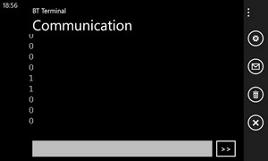

# IO Expansion Shield V7 with Serial Bluetooth and Button
Learn how to use the DFRobot IO Expansion Shield V7 with Serial Bluetooth Communication and Button

# Required Components
* [DFRobot IO Expansion Shield V7 or V7.1](http://www.dfrobot.com/index.php?route=product/product&product_id=1009#.Ui0468Ywceo) {:target="_blank"}
* [Bluetooth Bee](http://www.dfrobot.com/index.php?route=product/product&product_id=193&search=bluetooth+bee&description=true) {:target="_blank"}
* Push button
* 1x 10k resistor
* Wires (M/M and M/F)

# Info on using Serial
* A tutorial already exist [See how here](https://github.com/ms-iot/content/blob/develop/TXRX.md) {:target="_blank"}

# Bluetooth Bee connection with computer (assuming you already have Bluetooth configured on your PC)
1. Connect Bluetooth Bee to IO Expansion shield
2. Power up the Galileo
3. In Windows, pair the Bluetooth Bee (default code is 1234), go in Bluetooth Bee device properties to see what COM port is taken (COMXX...)
3. Open a terminal program ([Tera Term](http://ttssh2.sourceforge.jp/) {:target="_blank"} is what I use)
4. Open a session using the COM port
4. Default for Bluetooth Bee is 9600baud, Data: 8bit, Parity: None, Stop: 1bit. Be sure your terminal program is configured that way (usually by default)

# Bluetooth Bee connection with Windows Phone
1. Connect Bluetooth Bee to IO Expansion shield
2. Power up the Galileo
3. On phone: Open Settings - Bluetooth
4. Pair with Bluetooth Bee using 1234 code
5. Install BT Terminal from Store
4. Open BT Terminal app and select Bluetooth Bee

# Create the project
1. Create a new project from the template.
2. Copy code below and build (From Visual Studio: Build -> Build Solution)

# Code

### Main.cpp

// Main.cpp : Defines the entry point for the console application.
//

#include "stdafx.h"
#include "arduino.h"

int _tmain(int argc, _TCHAR* argv[])
{
	return RunArduinoSketch();
}

int pushButton = 2;

// the setup routine runs once when you press reset:
void setup() {
	// initialize serial communication at 9600 bits per second:
	Serial.begin(9600);
	// make the pushbutton's pin an input:
	pinMode(pushButton, INPUT);
}

// the loop routine runs over and over again forever:
void serialEvent() {
	// read the input pin:
	int buttonState = digitalRead(pushButton);
	// print out the state of the button:
	Serial.println(buttonState);
	delay(100);        // delay in between reads for stability
}

void loop()
{
	Sleep(250);
}


# Build and Run
1. Build the exe
2. Copy the exe in Galileo SD Card using Explorer 
3. Open telnet session to galileo (telnet mygalileo)
4. Go to file folder and type "start /b NameOfFile.exe" to run the file 
5. Reopen the terminal program for the Bluetooth. You will see the number 0 appear, going to 1 when you push the button
6. I used "kill NameOfFile.exe" to exit program.

# Result

From Windows Phone:

# Troubleshooting
1. Check that the switch on the shield is set to "RUN", not "PROG"
2. If nothing happens in the terminal, just type something like "Enter" key

---
