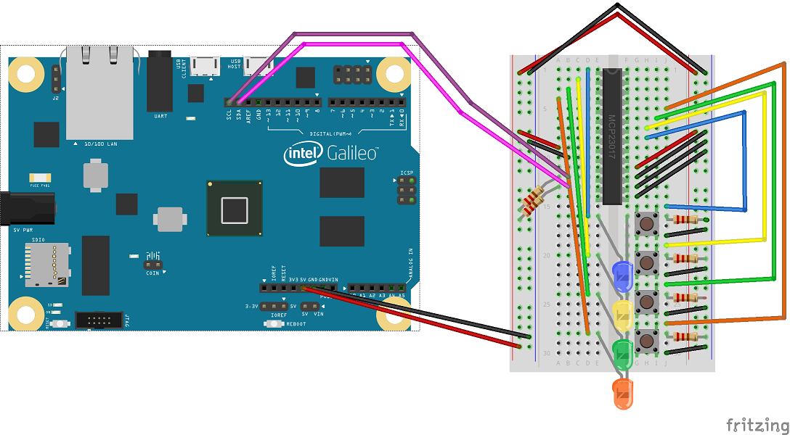

#MCP23017 Sample
Use an MCP23017 - i2c 16 input/output port expander in a Windows Developer Program for IoT project.  This sample assumes you have been through the "HelloBlinky" sample and have already created a Windows On Devices Project.

##Add the MCP23017 Sample parts list
1 x MCP23017
4 x LEDs
4 x Resistors for the LEDs
2 x Resistors for the I2C lines
4 x Push buttons 

##Create a new Project
Open Visual Studio. Select File -> New Project and Select Templates -> Visual C++ -> Windows for IoT -> Galileo Wiring app

##Add the MCP23017 Sample Code
You will need to add MCP23017.h & MCP23017.cpp to your project and update your Main.cpp.

##MCP23017.h Code

class MCP23017
{
public:
	MCP23017(unsigned char address);
	virtual ~MCP23017();

	void Init();

	void SetPortAInputPins(unsigned char pin);
	void SetPortBInputPins(unsigned char pin);

	void SetPortAInvert(unsigned char pin);
	void SetPortBInvert(unsigned char pin);

	void SetPortAPullUp(unsigned char pin);
	void SetPortBPullUp(unsigned char pin);

	unsigned char ReadPortA();
	unsigned char ReadPortB();

	void WritePortA(unsigned char pinToSet);
	void WritePortB(unsigned char pinToSet);

private:
	unsigned char _address;
	TwoWire _i2c;
};


##MCP23017.cpp Code

#include "MCP23017.h"
#include "arduino.h"

// TABLE 1-6: CONTROL REGISTER SUMMARY (IOCON.BANK = 0)
const unsigned char IODIRA = 0x00;
const unsigned char IODIRB = 0x01;
const unsigned char IPOLA = 0x02;
const unsigned char IPOLB = 0x03;
const unsigned char GPINTENA = 0x04;
const unsigned char GPINTENB = 0x05;
const unsigned char DEFVALA = 0x06;
const unsigned char DEFVALB = 0x07;
const unsigned char INTCONA = 0x08;
const unsigned char INTCONB = 0x09;
const unsigned char IOCON = 0x0A;
const unsigned char GPPUA = 0x0C;
const unsigned char GPPUB = 0x0D;
const unsigned char INTFA = 0x0E;
const unsigned char INTFB = 0x0F;
const unsigned char INTCAPA = 0x10;
const unsigned char INTCAPB = 0x11;
const unsigned char GPIOA = 0x12;
const unsigned char GPIOB = 0x13;
const unsigned char OLATA = 0x14;
const unsigned char OLATB = 0x15;

MCP23017::MCP23017(unsigned char address)
{
	_address = address;
}

MCP23017::~MCP23017()
{
}

void MCP23017::Init()
{
	_i2c.begin();
}

// Program the IO Expander to select the Port A input pins
void MCP23017::SetPortAInputPins(unsigned char pin)
{
	_i2c.beginTransmission(_address);
	_i2c.write(IODIRA);
	_i2c.write(pin);
	_i2c.endTransmission();
	
}

// Program the IO Expander to select the Port B input pins
void MCP23017::SetPortBInputPins(unsigned char pin)
{
	_i2c.beginTransmission(_address);
	_i2c.write(IODIRB);
	_i2c.write(pin);
	_i2c.endTransmission();
}

// Program the IO Expander to select inversion on port A input pins
void MCP23017::SetPortAInvert(unsigned char pin)
{
	_i2c.beginTransmission(_address);
	_i2c.write(IPOLA);
	_i2c.write(pin);
	_i2c.endTransmission();
}

// Program the IO Expander to select inversion on port B input pins
void MCP23017::SetPortBInvert(unsigned char pin)
{
	_i2c.beginTransmission(_address);
	_i2c.write(IPOLB);
	_i2c.write(pin);
	_i2c.endTransmission();
}

// Program the IO Expander to select internal pullups on port A input pins
void MCP23017::SetPortAPullUp(unsigned char pin)
{
	_i2c.beginTransmission(_address);
	_i2c.write(GPPUA);
	_i2c.write(pin);
	_i2c.endTransmission();
}

// Program the IO Expander to select internal pullups on port B input pins
void MCP23017::SetPortBPullUp(unsigned char pin)
{
	_i2c.beginTransmission(_address);
	_i2c.write(GPPUB);
	_i2c.write(pin);
	_i2c.endTransmission();
}

// Read the port A input pins
unsigned char MCP23017::ReadPortA()
{
	_i2c.beginTransmission(_address);
	_i2c.write(GPIOA);
	_i2c.endTransmission();

	_i2c.requestFrom(_address, 1);
	unsigned char value = (unsigned char)_i2c.read();
	return value;
}

// Read the port B input pins
unsigned char MCP23017::ReadPortB()
{
	_i2c.beginTransmission(_address);
	_i2c.write(GPIOB);
	_i2c.endTransmission();
	_i2c.requestFrom(_address, 1);
	unsigned char value = (unsigned char)_i2c.read();
	return value;
}

// Write to port A output pins
void MCP23017::WritePortA(unsigned char pinToSet)
{
	_i2c.beginTransmission(_address);
	_i2c.write(GPIOA);
	_i2c.write(pinToSet);
	_i2c.endTransmission();
}

// Write to port B output pins
void MCP23017::WritePortB(unsigned char pinToSet)
{
	_i2c.beginTransmission(_address);
	_i2c.write(GPIOB);
	_i2c.write(pinToSet);
	_i2c.endTransmission();
}


##Main.cpp Code

// Main.cpp : Defines the entry point for the console application.
//

#include "stdafx.h"
#include "arduino.h"
#include "MCP23017.h"

//
// This sample supports 4 LEDs on port B of our MCP23017 IO expander
// and 4 buttons on port A of our expander.  It has 2 modes: "cycle mode"
// and "input mode".  By default, the program is in cycle mode, lighting
// each LED in sequence.  If the user presses a button, the program enters
// input mode where each button is able to light it's corresponding LED.
// If the user stops pressing buttons for 1.5 seconds, the program falls
// back into cycle mode.  
//

// use an MCP23017 IO Expander on I2C address 0x20.
MCP23017 expander(0x20);

// Every program needs an entry point.  This is ours.
int _tmain(int argc, _TCHAR* argv[])
{
    return RunArduinoSketch();
}

// The setup function gets called once when the program starts.  
void setup()
{
	// Initialize the IO Expander
	expander.Init();

	// Configure all 8 pins on port A for input
	expander.SetPortAInputPins(0xff);

	// Invert port A so that a low logic level (pressed) returns a high bit.
	expander.SetPortAInvert(0xff);

	// Add internal pull-up resistors to all the port A pins so that the default is "not pressed".
	expander.SetPortAPullUp(0xff);

	// Configure all 8 pins on port B for output
	expander.SetPortBInputPins(0x00);

	// Turn all teh LEDs off.  
	expander.WritePortB(0x00);
}

// the loop routine runs over and over again forever.
void loop()
{
	// Is the program in "input mode"
	static bool inputMode = false;

	// Keep track of our last button press so we know when to fall out of input mode
	static unsigned long lastPressTime = 0;

	// How long without input (in milliseconds) before we fall out of input mode?
	const unsigned long timeout = 1500;

	// Keep track of which LEDs are lit when we're in cycle mode.
	static unsigned char lights = 0x01;

	// Read the buttons on the IO Expander
	unsigned char buttons = expander.ReadPortA();

	if (buttons != 0)
	{
		// If any buttons are pressed, go into input mode
		inputMode = true;
		lastPressTime = millis();
	}
	else
	{
		// If no buttons are pressed, check our timeout and possibly fall out of input mode
		if (millis() - lastPressTime >= timeout)
		{
			inputMode = false;
		}
	}

	if (inputMode)
	{
		// In input mode, light the LEDs according to the pressed buttons
		expander.WritePortB(buttons);
	}
	else
	{
		// In cycle mode, write the LEDs according to our cycle counter. 
		expander.WritePortB(lights);

		// Shift to the next LED 
		lights <<= 1;

		// If we've gone past the 4th LED, go back to the first one.
		if (lights >= 0x10)
		{
			lights = 0x01;
		}

		// And leave it lit for 100 milliseconds before cycling again.
		Sleep(100);
	}
}


##Wire your Galileo with an MCP23017
LEDs are diodes which will emit light when powered. They are polarized - meaning they work only when plugged in correctly.

##Result
You should see the 4 LEDs blinking. Pressing a button will light the LED associated with that button until the button is released.

---
[&laquo; Return to Samples](SampleApps.htm){: .btn .btn-default} 

