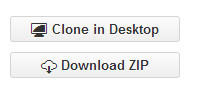

# Get Setup 

In order to contribute, you must first install Git on your machine:

### Installing Git 

The easiest way to get all the Git tools is to download [GitHub Desktop](https://desktop.github.com/).  This will install Git, Git shell, GitHub Desktop, and keep you up to date.

### Setting up Jekyll on Windows
1. We use this easy to follow [Jekyll on Windows](http://jekyllrb.com/docs/windows/) guide. Rouge is the option for highlighting that seems to work best for most users.

### Fork the repository

1. Create a [GitHub](https://github.com/) account 
2. From GitHub Home, navigate to the repository you'd like to contribute to (e.g. ms-iot/content)
3. Click *Fork*  
4. Clone the repository in one of several ways: 
  1. Command line 
  
    `git clone [link to .git] [NameYourLocalFolder] `
  2. Launch the GitHub app 
  
     Click 'Clone in Desktop'
     
     
  3. Clone using the GitHub Desktop application. 
  4. Using your own git flow (e.g. sourcetree) 
5. Set up your upstream 

  `git remote add upstream [link to .git] ` 

For clarification:

**local repository:**: the cloned repository that you have one on your machine 

**forked repository:**: the fork you made from the main repository. This sits up on GitHub's servers. (Also known as "*origin*") 

**main repository:** the original repository that you forked from. This is the common ms-iot repository hosted on GitHub's servers. (Also known as "*upstream*") 

___

### How to contribute

1. **[Get set up](Resources/contribute/get-setup.md)**
2. [Making changes](Resources/contribute/making-changes.md) 
3. [Authoring guidelines and best practices](Resources/contribute/authoring-guidelines.md.md)