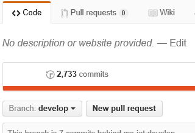

## Making changes

If your repo is really stale, do this to get it up to date with the ms-iot repo. **Note** it will blow away all local changes, so make sure it's what you want.

///
  `git reset --hard upstream/develop`

1. Read [contributing guidelines](topic-guidance.md).
  1. Changes that do not follow the guidelines will be rejected
2. Edit, build, test
  1. Using cmd.exe, from within the *content* folder start a local server:
  
    `jekyll serve --incremental`
  2. If prompted by the firewall, allow Jekyll to serve content
  3. Open your web browser and point it to the local server. localhost:4000/content is the default
  4. 4.	Edit using your favorite text editor. Jekyll will automatically update the content after every save.
3. Commit changes 
  1. When ready, add the files you want to to be staged for commit:
    * `git add [file]`
  2. Once done, commit your changes:
    * `git commit -m "[descriptive message]" `
    
**Note:** you won't see the correct formatting with a local server for certain aspects of the website:
  * Header/footer
  * Margins
this is to be expected. We still highly recommend rendering and verifying locally

### Submitting a Pull Request

A pull request (PR) is a request to the ms-iot team to accept your changes. It must first be approved by the team, but once accepted, it will immediately go live.

1. Brab the latest changes from upstream

    `git fetch upstream`
    
2. Merge it into your local repository
    1. `git merge upstream/develop`
    2. If you run into conflicts, you will have to hand-merge
    
       You can use your favorite merging tool or even notepad for this. 
    3. After hand-merging, you can continue the merge
        * `git add [fileYouHandMerged]`
        
3. Check your repositories status
  * `git status`. You may need to continue the merge to finish.

4. Push your changes to your forked repository.
    * `git push origin develop`
    
5. Submit your pull request from your forked repository using the GitHub website.

   

6. If it's your first pull request, sign the Contribution License Agreement 
  1.	Without completing this step, we unfortunately cannot accept a pull request. You only need to do this once. 

### Making changes to a pull request

1. Make your new changes, fetch upstream, merge upstream, and push your changes.
    * If your pull request was never closed, you should not have to submit a new pull request. It should automatically update.
    
### Git guidelines

When evaluating PRs, the following guidelines must be met:

1. Must be auto-mergable.
    * You should have done the work so that we can automatically merge your changes with the current state of the repository. Otherwise we will reject your pull-request and wait until you have fixed it.
    * If, after you make your changes and submit your PR, you find it cannot be automerged, simply update your fork with the latest from our repo and fix the conflicts - that should make it auto-mergable
2. Never have duplicate commits

## [Next Step - Topic guidance and best practices](topic-guidance.md)