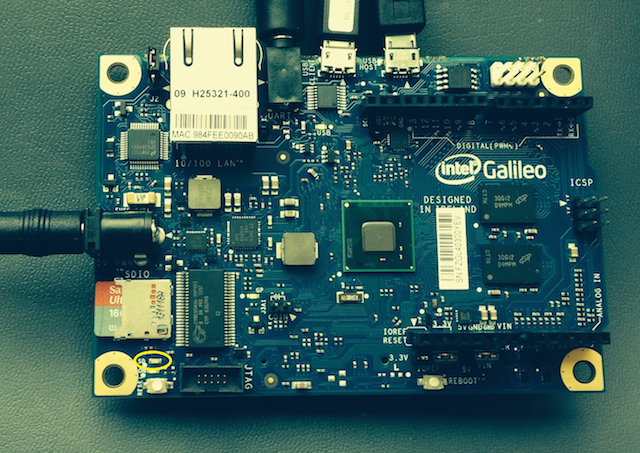
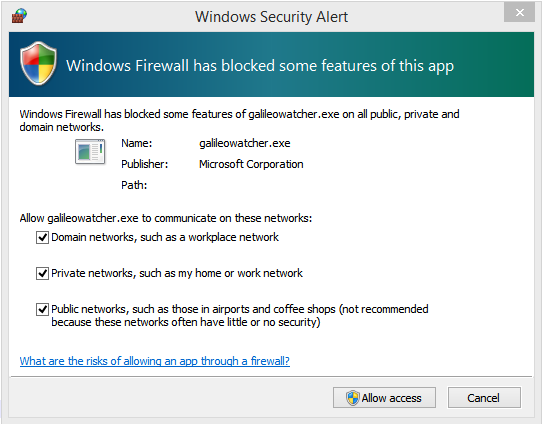
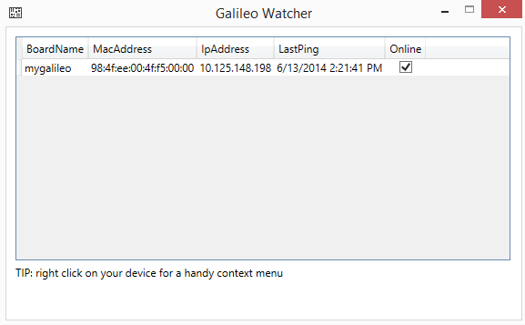
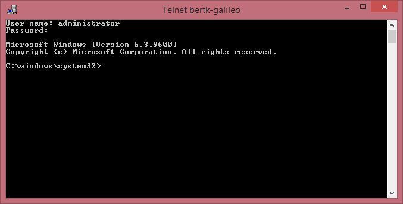

  <h1>Setting up your Galileo</h1>
  

  <h2>What is in the box?</h2>
  Included with your Windows Developer Program for IoT kit are the following:
  <ul>
    <li>Intel Galileo</li>
    <li>Power Adapter</li>
    <li>SD card case containing a microSD card in an SD card adapter</li>
    <li>Ethernet cable</li>
    <li>an LED</li>
    <li>USB to Ethernet adapter</li>
  </ul>
  
  <!--
  If you do NOT have an SD card containing the Windows image or if a new Windows build has been released, you can follow the steps below to build your own image.
  

  <h2>Building your own Windows image</h2>
  

    
NOTE:

    
This step is only required if your kit does not have an microSD card with a Windows image.

  

  You will need to attain a microSD card (We suggest at least 8 GB) and format it Fat32. 
  Please download the following files from the Windows Developer Program for IoT download site:
  <ul>
  <li><a href="http://go.microsoft.com/fwlink/?LinkID=403150" target="_blank">Windows Developer Program for IOT CTP1 - WIM</a></li>
  <li><a href="http://go.microsoft.com/fwlink/?LinkID=403796" target="_blank">apply-BootMedia.cmd</a></li>
  </ul>
   
  
Run the included script from an <b>elevated</b> Command Prompt: 
  <kbd>apply-bootmedia.cmd -destination {YourSDCardDrive} -image {.wimFile} -hostname mygalileo -password admin</kbd>

  
For example:

  <kbd>apply-bootmedia.cmd -destination e:\ -image BootMe-Galileo-8967-Mon.06.16.2014.17.47.29.42.wim -hostname mygalileo -password admin</kbd>
    
This process will take some time.

  -->
  

  <h2>Insert the microSD card</h2>
  <ol>
    <li>Remove the microSD card with the Windows Image from the SD card adapter.</li>
    <li>Insert the microSD card into the Galileo's microSD card slot near the power port. (Note: This step must be done prior to plugging in the power.)</li>
  </ol>
  

  <h2>Connect Ethernet on Galileo to Ethernet Directly to PC or Laptop</h2>
  Connecting the Galileo directly to your computer will allow you to communicate with just your Galileo. You will still have internet connectivity, and your computer will be able to communicate with your Galileo.
  <ol>
    <li>Connect one end of the network cable to the ethernet port on your Galileo</li>
    <li>Connect the other end of the network cable to the USB ethernet adapter</li>
    <li>Plug the USB Ethernet adapter into your PC's USB adapter</li>
  </ol>
  

  <h2>Plug the power cord into the Galileo.</h2>
  

    
NOTE:

    
Windows on Galileo can take about 2 minutes to boot. During this time you will see the microSD activity LED flashing rapidly. Once it stops flashing for a few seconds, the Galileo is fully booted.

  

  <ol>
    <li>You should see activity on the microSD light as it boots. The LED is at the bottom left of this picture.</li>
     
    

      
    

    <li>
      <b>
        As soon as you see data coming through the connection by light flashing on your Galileo's Ethernet port, open GalileoWatcher.exe from C:\Program Files (x86)\Microsoft IoT\
      </b>
       
      Make sure to allow it through the firewall when the security dialog comes up.
       
      
       
      Once your Galileo board finishes booting up (microSD LED should stop flashing with activity) it should begin broadcasting its IP Address and Host Name. This data should show up on GalileoWatcher like below.
    </li>
    

      
    

     
    <li>
      For extra verification, you can open a command window on your desktop and type <kbd>ping -4 mygalileo</kbd> to see if it's on the network
    </li>
     
    

      
    

  </ol>
  

  <h2>Telnet into your Galileo</h2>
  The main reason you'll want to telnet into your Galileo is so that you can interact with your Galileo and gracefully shut it down.
  
On your desktop select Start->Run and type <kbd>telnet mygalileo</kbd>.

  When prompted by telnet, use the following username and password: 
  
<kbd>Username: Administrator</kbd> 
  <kbd>Password: admin</kbd>

  

  <h3>Shutting down the Galileo</h3>
  Before you unplug the power from the Galileo, it is advisable to gracefully shut it down. To do this: 
  <ol>
    <li>Telnet to the Galileo as described above</li>
    <li>Enter the following command to shutdown: 
    <kbd>shutdown /s /t 0</kbd>
    </li>
  </ol>
  
After the microSD activity LED stops blinking, you may unplug the Galileo.

  

    
NOTE:

    
If you do not shut the Galileo down, the next boot will take much longer. During this time, Windows will run a check disk on the SD card to verify the integrity of the file system. Please allow this to finish.

  

  

  <a class="btn btn-default" href="index.htm" role="button">Return to homepage</a>
  <a class="btn btn-default" href="SampleApps.htm" role="button">Continue to Samples &raquo;</a>
