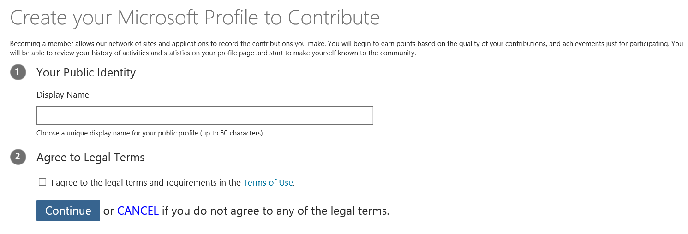
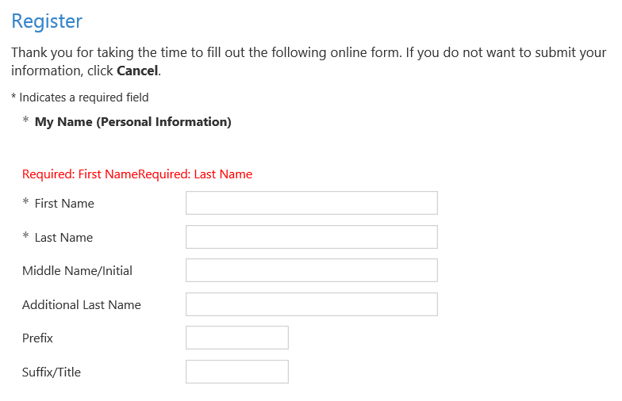
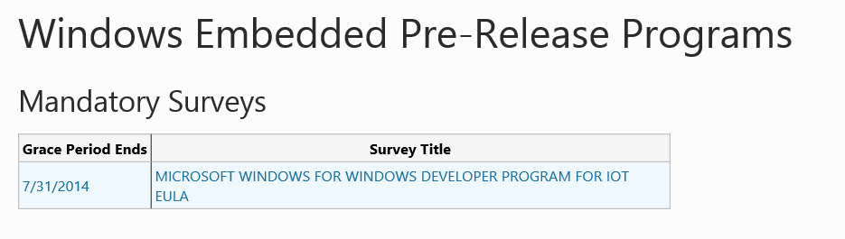

  <h1>Signing into Microsoft Connect</h1>
  

  Before downloading any software, you must sign up for the Windows Developer Program for IoT on Microsoft Connect. This is a necessary step in order to download the WindowsDeveloperProgramforIOT.msi and other program files. 
    
  Microsoft Connect facilitates a unified hosting service for file downloads and provides users with an interface for reporting potential bugs and valuable feedback in our product. The flow of the Microsoft Connect sign-up process can vary based on a number of circumstances.
    
  Choose the relevant drop-down option below to receive instructions on the process.
    

  

    

      

        <h4 class="panel-title">
          <a data-toggle="collapse" data-parent="#accordion" href="#collapseOne">
            I do not have a Microsoft Account email (@outlook, @live, @hotmail, etc.) 
          </a>
        </h4>
      

      

        

          If you do not already have a Microsoft Account email, you will need one to complete the Microsoft Connect sign-up. Below is an image of the page you will see upon clicking the Microsoft Connect link. The “Sign Up now” link is circled in red.
	         
          Upon completing the sign-up form for a Microsoft Account email, you will be directed to the original intended destination of the link – the Microsoft Connect Registration web site.  It will look like the image included here:
             
          Click the “Continue” button to move on to a social.microsoft.com web page – on this site, you will need to enter a Public Identity Display Name that can be used to post content on our Microsoft Connect site.  You will also need to agree to the Legal Terms of using a social.microsoft.com site.  The web site should appear as pictured here:
             
          After choosing a Display Name and agreeing to the terms of the site, click the “Continue” button to move on to a profile.microsoft.com web page. 
             
          This is the actual sign-up page for the Microsoft Connect website.  Here, you can create your Microsoft Connect profile and choose to receive a variety of updates from Microsoft.  Fill out the information on the form and click the “Submit” button.  At this point, your Microsoft Connect profile has been created and you’ll be redirected to the site where we host our EULA agreement for the MSI.  This site looks like this:
             
	      You should notice the public Display Name you chose earlier in the top-right corner of the web page – you’ve successfully created your Microsoft Connect profile.  Now, click on the Survey Title “MICROSOFT WINDOWS FOR WINDOWS DEVELOPER PROGRAM FOR IOT EULA” to read and accept the EULA.  Note the radio buttons at the very bottom of the EULA form, and choose either “I Accept” or “I Decline” accordingly.  Then, press “Submit” to submit the EULA.  This will take you to the Completed Registration page, pictured here:
             
          If you want to download the MSI immediately, you can click the “Return to the connection home page” to visit the Windows Developer Program for IoT home page on Microsoft Connect.  The page will look this this:
             
	      By clicking the “Downloads” link, you will be directed to the web site that hosts all of the available downloads associated with our program.  You’re free to download any of them, including a text version of the EULA you just signed to finish registration, but you’re looking to download the MSI.  To do so, click the link circled in red below.
             
	      Upon clicking the link, you will be directed to the actual download page for the MSI.  There will be information about the file itself, as well as a set of links.  Be sure to click the link circled in red in the picture below to download the MSI.
	         
          Congratulations! You are now finished downloading the MSI and registering for Microsoft Connect!
        

      

    

    

      

        <h4 class="panel-title">
          <a data-toggle="collapse" data-parent="#accordion" href="#collapseTwo">
            I have a Microsoft Account email (@outlook, @live, @hotmail, etc.), but I do not have a Microsoft Connect account
          </a>
        </h4>
      

      

        

	      Upon clicking the Microsoft Connect link, you will be directed to sign-in to your Microsoft Account email, if you are not already signed into your Microsoft Account email in another window or tab. Once you’ve signed in, you will be directed to the original intended destination of the link – the Microsoft Connect Registration web site. It will look like the image included here:
		     
		  Click the “Continue” button to move on to a social.microsoft.com web page – on this site, you will need to enter a Public Identity Display Name that can be used to post content on our Microsoft Connect site. You will also need to agree to the Legal Terms of using a social.microsoft.com site. The web site should appear as pictured here:
             
          After choosing a Display Name and agreeing to the terms of the site, click the “Continue” button to move on to a profile.microsoft.com web page. 
             
          This is the actual sign-up page for the Microsoft Connect website.  Here, you can create your Microsoft Connect profile and choose to receive a variety of updates from Microsoft.  Fill out the information on the form and click the “Submit” button.  At this point, your Microsoft Connect profile has been created and you’ll be redirected to the site where we host our EULA agreement for the MSI.  This site looks like this:
             
	      You should notice the public Display Name you chose earlier in the top-right corner of the web page – you’ve successfully created your Microsoft Connect profile.  Now, click on the Survey Title “MICROSOFT WINDOWS FOR WINDOWS DEVELOPER PROGRAM FOR IOT EULA” to read and accept the EULA.  Note the radio buttons at the very bottom of the EULA form, and choose either “I Accept” or “I Decline” accordingly.  Then, press “Submit” to submit the EULA.  This will take you to the Completed Registration page, pictured here:
             
          If you want to download the MSI immediately, you can click the “Return to the connection home page” to visit the Windows Developer Program for IoT home page on Microsoft Connect.  The page will look this this:
             
	      By clicking the “Downloads” link, you will be directed to the web site that hosts all of the available downloads associated with our program.  You’re free to download any of them, including a text version of the EULA you just signed to finish registration, but you’re looking to download the MSI.  To do so, click the link circled in red below.
             
	      Upon clicking the link, you will be directed to the actual download page for the MSI.  There will be information about the file itself, as well as a set of links.  Be sure to click the link circled in red in the picture below to download the MSI.
	         
          Congratulations! You are now finished downloading the MSI and registering for Microsoft Connect!
        

      

    

    

      

        <h4 class="panel-title">
          <a data-toggle="collapse" data-parent="#accordion" href="#collapseThree">
            I already have a Microsoft Connect account
          </a>
        </h4>
      

      

        

		  Upon clicking the Microsoft Connect link, you will be directed to sign-in to your Microsoft Account email, if you are not already signed into your Microsoft Account email in another window or tab. Once you’ve signed in, you will be directed to the original intended destination of the link – the Microsoft Connect Survey web site. It will look like the image included here:
		     
	      Now, click on the Survey Title “MICROSOFT WINDOWS FOR WINDOWS DEVELOPER PROGRAM FOR IOT EULA” to read and accept the EULA. Note the radio buttons at the very bottom of the EULA form, and choose either “I Accept” or “I Decline” accordingly. Then, press “Submit” to submit the EULA. This will take you to the Completed Registration page, pictured here:
             
          If you want to download the MSI immediately, you can click the “Return to the connection home page” to visit the Windows Developer Program for IoT home page on Microsoft Connect.  The page will look this this:
             
	      By clicking the “Downloads” link, you will be directed to the web site that hosts all of the available downloads associated with our program.  You’re free to download any of them, including a text version of the EULA you just signed to finish registration, but you’re looking to download the MSI.  To do so, click the link circled in red below.
             
	      Upon clicking the link, you will be directed to the actual download page for the MSI.  There will be information about the file itself, as well as a set of links.  Be sure to click the link circled in red in the picture below to download the MSI.
	         
          Congratulations! You are now finished downloading the MSI and registering for Microsoft Connect!
        

      

    

  

  

