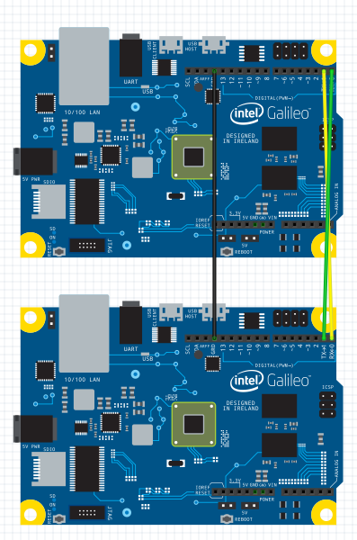

# Writing and reading from TX/RX pins
Learn how to use HardwareSerial to read and write from the TX/RX pins.

# Info on using HardwareSerial
* Serial = COM1 = TX/RX pins 
* To use <code>serialEvent()</code> you’ll need to edit the project settings
    * Right click on the Project in the Solution Explorer, then select <kbd>Properties</kbd>.
    * Under Configuration Properties -> C/C++ -> Preprocessor, add <kbd>SERIAL_EVENT;</kbd> to Preprocessor Definitions.

# Required Components
* 2 Galileos
* 3 wires to connect the Ground, TX, and RX pins between the two boards

# Create the projects

1. Create 2 new project from the template.
1. Follow the diagram below for hooking up the two galileos 

1. Replace the existing code in main.cpp of the 1st project (the write) with the code below:
1. Replace the existing code in main.cpp of the 2nd project (the read) with the code below:

# Code

### Main.cpp of the Write Project

#include "stdafx.h"
#include "arduino.h"

int _tmain(int argc, _TCHAR* argv[])
{
	return RunArduinoSketch();
}

void setup()
{
    Serial.begin(CBR_300, Serial.SERIAL_7O2);
}

int count = 0;

void loop()
{
    if (Serial.write('a' + count) != 1)
    {
        Log(L"Serial.write failed\n");
    }else{
        Log(L"%c being sent\n", 'a' + count++);
    }
    if (count == 26) { count = 0; }
    Sleep(1000);
}


### Main.cpp of the Read Project

#define SERIAL_EVENT
#include "stdafx.h"
#include "arduino.h"

int _tmain(int argc, _TCHAR* argv [])
{
    return RunArduinoSketch();
}

void setup()
{
    Serial.begin(CBR_300, Serial.SERIAL_7O2);
}

void loop()
{
    //int c = Serial.read();
    //if (c < 0)
    //{
    //    Log(L"Serial.read failed\n");
    //}
    //else{
    //    Log(L"Loop: %c\n", c);
    //}
}

void serialEvent()
{
    int c = Serial.read();
    if (c < 0)
    {
        Log(L"SerialEvent Serial.read failed\n");
    }
    else{
        Log(L"serialEvent: %c\n", c);
    }
}


  

<a class="btn btn-default" href="SampleApps.htm" role="button">&laquo; Return to Samples</a>
