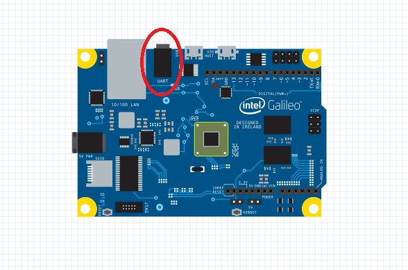
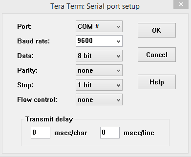

# Writing to UART
Learn how to use HardwareSerial to read and write to the UART port.

# Info on using UART and HardwareSerial

* HardwareSerial defines an object called Serial1.
    * This reads and writes to COM2 on the Windows Image which is linked to the UART port on the Galileo board. 
* To use <code>serialEvent1()</code> you’ll need to edit the project settings
    * Right click on the Project in the Solution Explorer, then select <kbd>Properties</kbd>.
    * Under Configuration Properties -> C/C++ -> Preprocessor, add <kbd>SERIAL_EVENT1;</kbd> to Preprocessor Definitions.

# Required Components
* [DB9 Female to 3.5mm Cable](http://www.amazon.com/SF-Cable-Female-Serial-Cable-6/dp/B004T9BBJC/ref=sr_1_1?ie=UTF8&qid=1407960957&sr=8-1&keywords=audio+to+serial+cable){:target="_blank"}
* [USB to Serial Cable](http://www.amazon.com/TRENDnet-RS-232-Serial-Converter-TU-S9/dp/B0007T27H8/ref=sr_1_1?ie=UTF8&qid=1407961117&sr=8-1&keywords=serial+to+usb){:target="_blank"}

# Allow UART to be used for HardwareSerial (This will change it from kernel debugger use)

1. Shut down Galileo and remove power
1. Remove microSD card and plug it in to a PC (Windows will automatically assign a drive letter, in our case it was "k")
1. Open an Administrative command prompt on your development machine:
	* <kbd>bcdedit /store k:\efi\microsoft\boot\bcd /enum</kbd>
	* Verify you got bcd contents
	* <kbd>bcdedit /store k:\efi\microsoft\boot\bcd /set {default} debug No</kbd>
	* <kbd>bcdedit /store c:\efi\microsoft\boot\bcd /set {default} testsigning OFF</kbd>
	* <kbd>bcdedit /store k:\efi\microsoft\boot\bcd /enum</kbd>
	* Verify debug and testsigning are now “No”
1. Safe dismount of microSD from PC by ejecting in Windows Explorer.
1. Put microSD in Galileo and powered up

# Create a new project

1. Create a new project from the template.
1. Plug the two serial ends of the cables together.
1. Plug the 3.5mm end of the cable into the UART jack on the Galileo board. 

1. Plug the USB end of the cable into your computer's USB port.
1. Open up Device Manager on your development machine and find out which COM port is being used by the adapter.
1. Open a terminal program like [Tera Term](http://download.cnet.com/Tera-Term/3000-20432_4-75766675.html){:target="_blank"}
1. Set the program to monitor the serial connection from the COM port you found in Step 5.
1. Make sure your options are as shown below (with the Port set to the COM port you found in Step 5): 
     
    * If you are using Tera Term, you can get to the menu shown above by clicking on Setup -> Serial port..
1. Replace the existing code in main.cpp with the following code:

# Code

### Main.cpp

#include "stdafx.h"
#include "arduino.h"

int _tmain(int argc, _TCHAR* argv[])
{
    return RunArduinoSketch();
}

void setup()
{
    Serial1.begin(CBR_9600, Serial.SERIAL_8N1);
}

char output = 'a';  // The character being written

void loop()
{
    // Handles the writing
    if (Serial1.write(output) != 1)
    {
        Log(L"Serial1.write failed\n");
    }
    else
    {
        Log(L"%c being sent\n", output);
    }
    
    // Loops the character from a to z
    if (output == 'z')
    {
        output = 'a';
    }
    else
    {
        output++;
    }
    
    Sleep(1000);
}


---

[&laquo; Return to Samples](SampleApps.htm){:role="button"}{:class="btn btn-default"}
