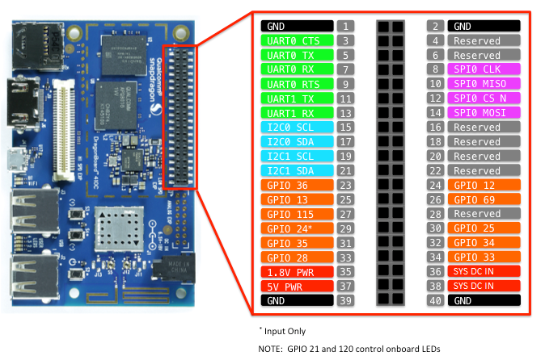
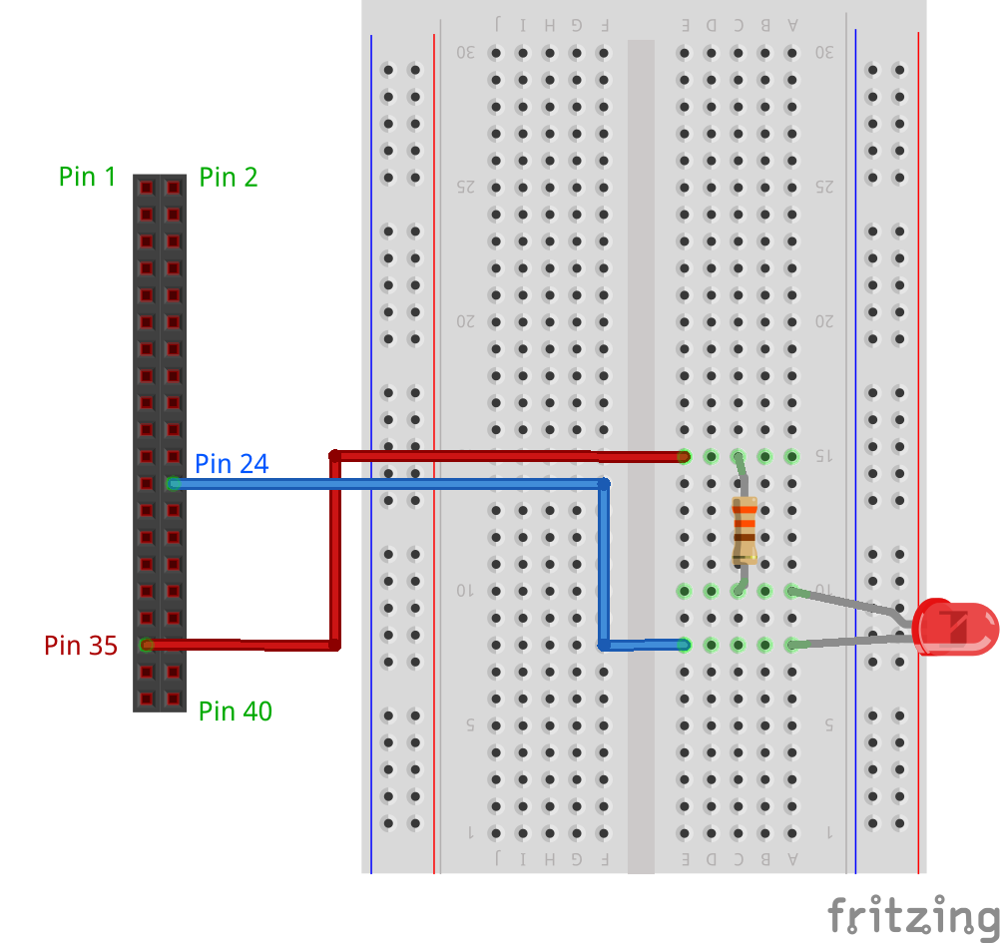

###For DragonBoard 410c (DB)

For reference, the functionality of the low-speed expansion connector is outlined in the following diagram

Perform the following steps to create the circuit:

1. Connect the shorter leg of the LED to GPIO 12 (pin 24 on the expansion header) on the DB.
2. Connect the longer leg of the LED to the resistor.
* Note that the polarity of the LED is important (this configuration is commonly known as Active Low).
3. Connect the other end of the resistor to 1.8V (pin 35 on the expansion header).

Here is an illustration of what your breadboard might look like with the circuit assembled:

Image made with [Fritzing](http://fritzing.org/){:target="_blank"}

Finally, the LED_PIN variable of _MainPage.xaml.cs_ file of the sample code will need the following modification:

~~~
private const int LED_PIN = 12;
~~~
{: .language-c#}

